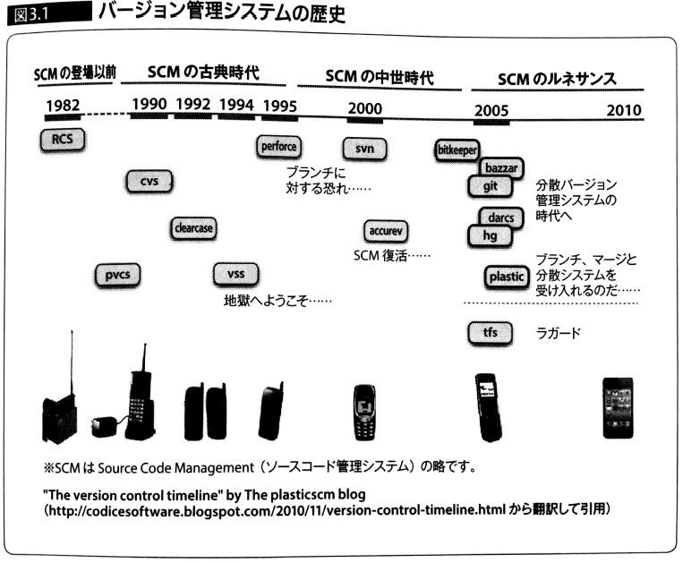

<!-- $theme: default -->
<!-- page_number: true -->
<!-- footer: @ryoa912 -->
<!-- prerender: true -->

チーム開発実践入門
===

###### Created by Ryoh Aruga ( [@ryoa912](https://github.com/yhatt) )

<!-- *page_number: false -->
<!-- *footer:  -->


---

# 目次


### 3.1 バージョン管理システム
- バージョン管理システムとは
- なぜバージョン管理システムを使うのか

### 3.2 バージョン管理システムの移り変わり
- バージョン管理システムの歴史
- 集中管理と分散管理
- バージョン管理システムの導入状況


---

# 3.1 バージョン管理システム


---

## バージョン管理システムとは
- あるファイルをいつ・誰が・どのように変更したかという履歴をバージョンとして記録して管理するシステム
- ソースコードに限らず、ファイルなら何でも管理可能
- 例： SDF, Git


---

## なぜバージョン管理システムを使うのか
- 変更内容という最も基本的な記録が残る
- バージョン間の差分を簡単に確認できる
- 間違って他人の変更を上書きしないで済むしくみがある
- 任意の時点まで巻き戻すことができる
- 複数の派生を作ることができる
- ある時点での断面を保存できる


    アンチパターン：
    変更履歴が残らない、他人の変更を知らぬ間に上書きできる、
    ブランチ切れない、ある時点のスナップショットが見れない


---

# 3.2 バージョン管理システムの移り変わり


---

## バージョン管理システムの歴史




---
## バージョン管理システムの導入状況

|Theme name|バージョン管理|C I|
|:-:|:-:|:-|
|Altair-PJ2|SDF|◯
|Soleil-PJ2.5|Git|◯
|Salyut-EM1|Gitの予定が<br>SDF希望された...|✕
|銀座サイネージ|Git|✕
|CL神田|Git|✕


---

# Enjoy team development! :+1:


---

## 以下、スライド素材


---

# How to write slides?

### `$theme`

Changes the theme of all the slides in the deck. You can also change from `View -> Theme` menu.

```
<!-- $theme: gaia -->
```

|Theme name|Value|Directive|
|:-:|:-:|:-|
|***Default***|default|`<!-- $theme: default -->`
|**Gaia**|gaia|`<!-- $theme: gaia -->`

> *Notice: Ruler (`<hr>`) is not displayed in Marp.*


---
* :heart:
* :soccer:
* :arrow_up_down:
* :exclamation:
* :calling:
* :shield:


