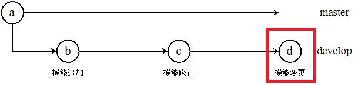
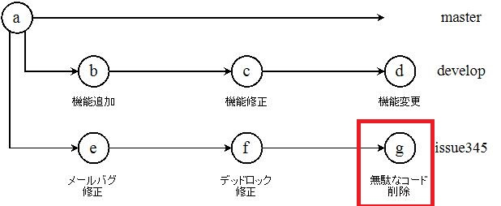
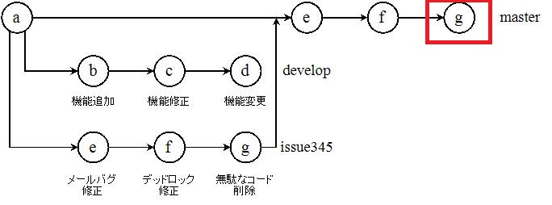

<!-- $theme: gaia -->

# 
チーム開発実践入門

### 
3.3~3.5

#### 
手島　史裕

---

# 目次

* 3.3 分散バージョン管理システム
* 3.4 バージョン管理システムをどう使うべきか
* 3.5 Gitを使ったスムーズな平行開発

---
## 3.3 分散バージョン管理システム
---

###### メリット

* リポジトリのコピーをローカルに配置可能
* 動作が速い
* 履歴管理が容易
* ブランチ、マージが容易
* 場所を選ばないコラボレーションが可能

	
###### デメリット

* 最新バージョンが存在しない
	* 中央リポジトリがシステム上に存在しないため任意に設定する必要がある
* 真の意味でのリビジョン番号がない
	* G分散バージョン管理システムでは **GUID** で変更が管理される
	* 直感的ではなくなるが、代わりにマージが容易になる
* ワークフローが柔軟に設定可能なため、混乱しやすい
	* どのリポジトリ間でも自由にPush/Pullが可能
	* 一般には中央リポジトリを設定し、各開発者がそこからcloneする
* 考え方に慣れるのに時間がかかる
	* 難しい

---
## 3.4 バージョン管理システムをどう使うべきか

---
## 管理すべきもの
###### ソースコード

* そもそもソースコード管理用に考えられたシステムである

###### ドキュメント

* プロジェクトの進行度合いでドキュメントにも変更がある
* Word, Excelのバイナリファイルは、バージョン管理には不向きのため、
**Markdown**、**Textile**、**reStructedText**など、textベースのものを利用するのが吉

###### データベーススキーマ、データ

* Webアプリを扱うにあたり、データのバージョン管理は必須

###### 設定ファイル
###### ライブラリなどの依存関係の定義

---
## 3.5 Gitを使ったスムーズな平行開発
## ブランチの使い方
---
###### クローンとブランチの作成

1. 中央リポジトリからローカルマシンにクローン
`git clone ***@github.com`
2. 機能追加のためにブランチを作成する
`git branch develop`
3. チェックアウトにより、ブランチを切り替える
`git checkout develop`
4. いくつかコミットする
`git commit -m "機能追加"`
`git commit -m "機能修正"`
`git commit -m "機能変更"`
コミット後は、以下のような状態になる

---
###### ブランチの切り替え

* 障害発生などで、masterに戻って作業するとき

1. チェックアウトでブランチを変える
`git checkout master`
2. 問題修正用のブランチを作成し、チェックアウトする
`git checkout -b issue345`
上記のコマンドでブランチ作成とチェックアウトを同時に行える

###### バグ修正後のコミット

1. バグ修正＆コミット
`git commit -m "メールバグ修正"`
`git commit -m "デッドロック修正"`
`git commit -m "無駄なコード削除"`
コミット後は、以下のような状態

---
###### masterへのマージ

* 修正結果をmasterにマージする
	`git checkout master`
    `git merge issue345`
    マージは、以下の図のような状態

###### masterへのPush

1. ローカルマシンのmasterにマージした修正を中央リポジトリにPushする
`git push origin master:master`
2. 元の開発をしていたブランチに戻る(図4のd)
`git checkout develop`

---
# タグの使い方
---

###### タグとは

* リリースタイミングをスナップショットとして記録できる機能
* 一般的にはバージョン番号を付けることが多い
* リリース時や障害対応ごとにタグを打つべきである

###### タグの作成

* タグをつけたいコミットを指定してタグを打つ
`git tag -a v0.1 GUID`
* タグの中身を確認する場合は、`git show v0.1`とすれば確認可能
* タグ作成後は中央リポジトリにPushする
`git push origin v0.1:v0.1`

