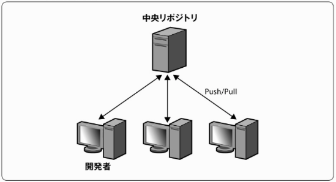
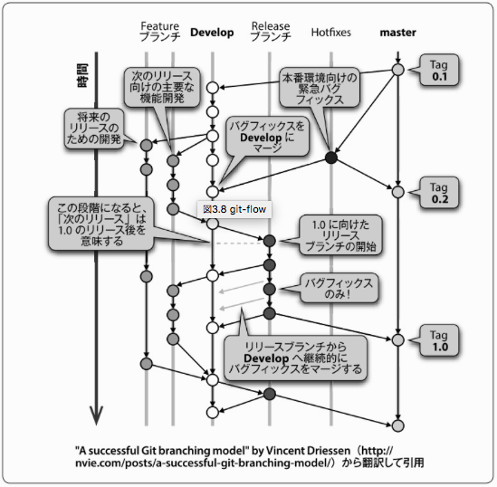

<!-- $theme: gaia -->

# gitを使ったワークフロー

----
# ワークフローのパターン
* 中央集権型ワークフロー
* GitHub型ワークフロー([統合マネージャー](https://www.slideshare.net/matsukaz/git-28304397/54)) 

----
# 中央集権型

* subversionに近い運用
* 社内のGit運用はほぼこれなのでは？

----
# GitHub型ワークフロー

* GitHubで標準的に採用されているやり方

----
#### GitHub型ワークフローの特徴
* 中央リポジトリの内容を[Fork](https://help.github.com/articles/fork-a-repo/)して開発を進める
* 各自のリモートリポジトリで開発し、Pull Requestを出して中央リポジトリにマージする

##### メリット
* 中央リポジトリの状況によらず開発を進めることができる
* (GitHubを使った場合特に)中央リポジトリにマージしたときの動作を全て自分のリモートリポジトリで再現できる(コンフリクトの確認や自動テストなど)

----
#### ブランチ戦略
* git-flow
* github-flow

この2つは知っていること必須！！

----
#### git-flow
2010年Vincent Driessen氏の『A successful Git branching model』で提案されたブランチ戦略

----
##### git-flowで使われるブランチ
名前 | 役割 | 種類
---------|------|------------
master | リリースされたブランチ | メインブランチ
develop | 開発用ブランチ | メインブランチ
feature | developに機能追加するためのブランチ | サポートブランチ
release | developのリリース準備のためのブランチ | サポートブランチ
hotfix | masterの障害対応のためのブランチ | サポートブランチ

----
### git-flowにおける運用
* masterはリリースされたソースコード
* developはリリース前の最新バージョン
* featureはdevelopから派生し、developにマージされる
* releaseはdevelopから派生し、masterとdevelopにマージされる
* hotfixはmasterから派生し、masterとdevelopと、存在すればreleaseにマージされる

----
#### git-flowの注意点
* 運用が複雑なので覚えることが多いし間違えやすい
* そのため[git-flowスクリプト](https://github.com/nvie/gitflow)を使うことが推奨
* GUIのGitクライアントを使う場合スクリプトが使えないことも多い

参考
[git-flowスクリプトの概要](http://rfs.jp/server/git/03git/howto-git-flow.html)

----
### github-flow
* 「Pro-Git」の著者でGitHubのオフィサーでもあるScott Chacon氏が発表

* masterはすべてリリース可能
* 新しく何かをするときはmasterから派生する
* 作成したブランチはローカルにコミットし、リモートリポジトリにも同じ名前で定期的にPushする
* 開発完了したらmasterへPull Requestを送る
* Pull Requestがレビューされたらmasterにマージし、その場で本番環境にリリースする(リリース物件を作る)

----
### github-flowのルール
* masterは直接触らない
* 作業を始める前にかならずmasterからbranchを切る
* masterへの変更はプルリクを経由する

----
### github-flowの難しいところ
* masterはリリース済みとするため、CI(Continuous Integration)やCD(Continuous Deployment)環境が必須
* プルリクを介したレビューではGitやGitHubの機能をかなり駆使しないと思ったとおりの修正ができない
	* 自分の開発中にmasterに更新があったときどう取り込むか
	* プルリクでスマートにレビューしてもらうためにコミットをどう作るか

----
### gitやGitHubの基礎を学びましょう
* [いつやるの？Git入門 v1.1.0](https://www.slideshare.net/matsukaz/git-28304397) 
* [Gitチュートリアル - Attlasian](https://www.atlassian.com/ja/git)
* GitHubの機能は膨大なため、一つのサイトでまとまっているものは今のところ見つかってないです・・・
	* 困った内容に対してググるのが解決策
	* あとは[Advent Calendar](http://qiita.com/advent-calendar)で探すとかかなぁ・・・

----
#### gitでの便利コマンド
* `git rebase` rebaseをうまく使えることが必須
* `git rebase -i`　コミットをまとめて修正
* `git cherry-pick`　特定のコミットだけを取り込む
* `git pull --rebase`　pullするときrebaseする
* `git merge --no-commit`　mergeするときコミットしない
* `git merge --no-ff`　fast-forwardでも必ずマージコミットを作る
* `git merge --squash` コミットをまとめてマージ

----
#### GitHubでのcommitメッセージTips
* `#issue番号`をつけると自動的にIssueにリファレンスがつく
* `close #issue番号`をつけるとこのメッセージがついたcommitがmasterにマージされると自動的に対象のIssueがcloseされる
* プルリクを承認してマージする人は`close #issue番号`をつけると良い