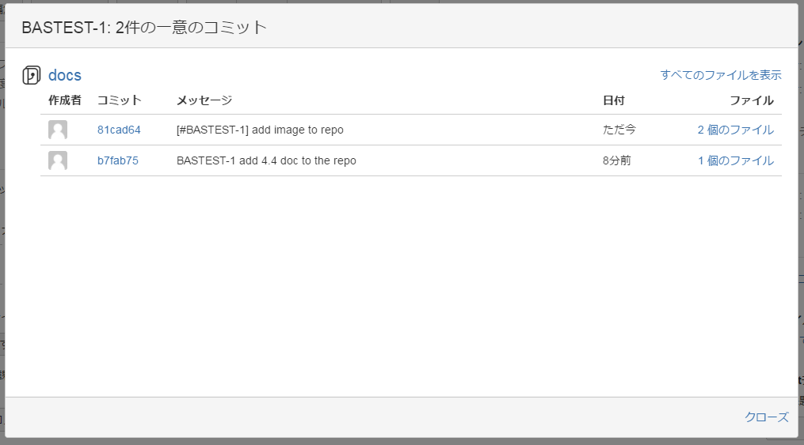

<!-- $theme: gaia -->

# 新機能の開発、バグの修正時のワークフロー

## 例に使うシステム
* チケット管理システム：JIRA
* バージョン管理システム:Git(GitHub)

----
## ワークフロー
* チケットの起票
* 担当者のアサイン
* 開発
* コミット
* リポジトリにプッシュ

----
#### チケットの起票
* 課題内容をもとにチケットを起票する

#### 担当者にアサイン
* チケットを担当の開発者にアサインする
* 伝統的： プロジェクトマネージャが適切な開発者を決める
* スクラム： 開発者自身がチケットを起票し、そのまま自分自身をアサインする

----
#### 開発
* チケットのステータスを「進行中」に変更して開発を始める

----
#### コミット
* コミットメッセージにチケット番号を記述する
>[#BASTEST-1] メール送信のバグを修正

----
#### リポジトリにプッシュ
* プッシュ後自動的に関連するチケットにリンクが貼られる(バージョン管理システムと連携している時)

* コミットにチケット番号を強制的に入れたい時Hookの仕組みを使ってチケット番号の有無をチェックするように実装

[参考リンク](http://monksealsoftware.com/add-jira-issue-number-to-git-commit-message/)

* 他のコミットコマンド(#close, #finished..)

[JIRAのコミットコマンド参考](https://ja.confluence.atlassian.com/jirasoftwarecloud/processing-issues-with-smart-commits-788960027.html)

----
## コラボの例
* チケット管理： Redmine
* バージョン管理： Git

ワークフロー | 実施度 | 感想
---------|------|------------
チケットの起票 | ◯ | 伝統的なやりかた
担当者にアサイン | ◯ | -
開発 | △ | バグ修正時チケット多くて、一個一個ステータスを変更してのは。。
コミット | ◯ | チケット番号を記述
リポジトリにプッシュ | △ | レビュー依頼のチケットだけリンクを貼られる

# 「あのバグいつ直ったの」という問い合わせに答える

## 前提条件
チケット管理システムとバージョン管理システムを連携していること

----
## 流れ
1. チケット番号や**記憶を頼りに**
2. 検索
3. チケットを特定してソースコードの変更を確認

----
## コラボの例(自分の感想+検討)
細かい修正などチケットに特定するまで時間がかかるかも。
JTを実施する時どうなるかを知りたい~

# 「なぜこんな変更が入ったんだろう」という疑問を解決する

## 疑問がある時
* コンパイル失敗やテスト失敗などの時

----
## 対応の仕方
* GitHubと自身が持つIssue機能: コミットに記載しているissue番号で直接issueに飛ぶ
* GitHubと他のチケット管理システム連携:　コミットに記載しているチケット番号でチケット管理システムで検索

# 4章のまとめ

**とりあえずチケット管理とバージョン管理を連携します!!!**

----
## 効果
* いつ、誰が、どうように行ったのかが関連付け
* 問題発生時の原因究明
* もっと早く問題を見つけたい！→5章のCIがあるよ

----
## 補足： 課題管理とチケット管理

----
### 課題の粒度(Scrum)
* エピック
* ストーリー
* タスク
* バグ、障害対応、問い合わせ

----
#### エピック
大きな要望、部署横断の課題など
* 非エンジニアが関わることが多い
* 複数人たちの編集、共有が簡単なものがよい
* あいまいな状態で始まるものが多い

内容例：　新しい市場を開拓するためのシステムを構築する

→オンライン表計算ソフトがよい(GoogleDocsなど)

----
#### ストーリー
具体的な要望、機能要求や仕様に近いレベル
* 製品に責任を持つ人が書くことが多い
* ステータス管理が必要である

内容例： ユーザアクセス状況をユーザID毎時間ごとに集計し、ダッシュボードに反映

→チケット管理システムの管理対象と考えてよい

----
#### タスク
* 具体的な作業内容
* ストーリーの下に複数ぶら下がる
* 担当者単独
* コードとの連携時がある

→チケット管理システムで管理すべき

----
#### バグ、障害対応、問い合わせ
* タスクに近い
* コードとの連携は必要

→チケット管理システムで管理すべき